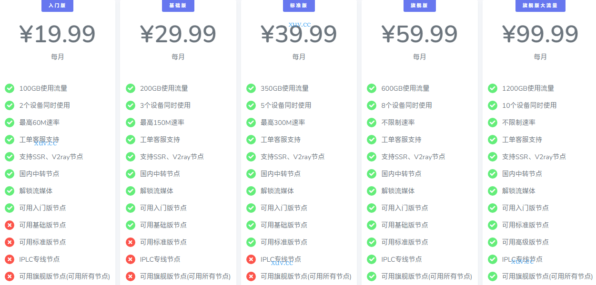

# 速云梯官网地址2025最新入口 + 优惠码

速云梯跑路了吗？暂时没有。不过机场总会有跑路风险，为尽可能减少损失，选购套餐可按月支付。下面是最新地址：

永久官网：[suyunti.com](https://xuv.cc/out/suyunti)

地址1：[suyunti.net](https://suyunti201.xyz/auth/register?code=8Qj5)

地址2：[https://suyunti70.xyz](https://suyunti70.xyz/auth/register?code=8Qj5)

## 简介

速云梯机场，suyunti，某大机场分站，成立于2018年，提供ShadowsocksR节点及V2Ray节点，支持的付款方式有微信支付和支付宝。

支持SSR、V2ray节点，国内中转节点，解锁流媒体，CN2/BGP隧道中转和IPLC国际专线节点。

## 速云梯优惠码

【优惠活动】

速云梯2025新年特惠包年7折优惠代码：[YYY1](https://xuv.cc/out/suyunti)

## 速云梯特色

> 线路高速稳定，抗封锁能力出众，流量充沛且带宽充足，每日可签到领取免费流量；
> 多达90多条节点集中分布美、日、新、港、台等热门地区；
> 套餐配置灵活，月付19元至99元，性价比高，可满足不同用户的应用需求；
> 全部线路采用 CN2/BGP 隧道中转优化，提供 IPLC 高速专线；
> 所有套餐均支持 Netflix、Disney+、TVB 等国外流媒体解锁；
> 支持全平台 Windows、Mac、Linux、Android、iOS 等各种操作系统的 ShadowsocksR(SSR)协议、V2Ray协议订阅；
> 站内提供订阅转换，方便不同协议配置，避免订阅信息泄露；
> 支付宝、微信直接支付，方便快捷；

## 套餐列表

|套餐|入门版|基础版|标准版|旗舰版|旗舰版大流量|
|----|----|----|----|----|----|
|月付|￥19.9|￥29.9|￥39.9|￥59.99|￥99.99|
|季付|￥59.97|￥89.97|￥119.97|￥179.97|￥299.97|
|半年付|￥119.94|￥179.94|￥239.94|￥359.94|￥599.94|
|年付|￥239.88|￥359.88|￥479.88|￥719.88|￥1199.88|
|两年付|￥479.76|￥719.76|￥959.76|￥1439.76|￥2303.76|

速云梯套餐区别：

|入门版|基础版|标准版|旗舰版|旗舰版大流量|
|----|----|----|----|----|
|100GB使用流量 2个设备同时使用 最高60M速率 工单客服支持 支持SSR、V2ray节点 国内中转节点 解锁流媒体 可用入门版节点|200GB使用流量 3个设备同时使用 最高150M速率 工单客服支持 支持SSR、V2ray节点 国内中转节点 解锁流媒体 可用入门版节点 可用基础版节点|350GB使用流量 5个设备同时使用 最高300M速率 工单客服支持 支持SSR、V2ray节点 国内中转节点 解锁流媒体 可用入门版节点 可用基础版节点 可用标准版节点|600GB使用流量 8个设备同时使用 不限制速率 Telegram客服技术支持 支持SSR、V2ray节点 国内中转节点 解锁流媒体 可用入门版节点 可用基础版节点 可用标准版节点 IPLC专线节点 可用旗舰版节点(可用所有节点)|1200GB使用流量 10个设备同时使用 不限制速率 Telegram客服技术支持 支持SSR、V2ray节点 国内中转节点 解锁流媒体 可用入门版节点 可用基础版节点 可用标准版节点 IPLC专线节点 可用旗舰版节点(可用所有节点)|

## 速云梯官网常见问题

**问：为什么刚过凌晨12点，网站上今日已用就跑了很多流量？**

答：流量重置时间为每日凌晨3点。

**问：为什么我的流量多扣了？**

答：流量是不会多扣的，一般这种情况都为订阅链接不小心泄露出去导致订阅被盗。

**问：我的订阅被盗了，应该怎么办？**

答：请在网站节点设置内重置订阅链接和重置连接密码即可。
